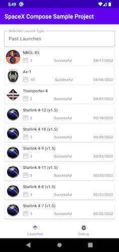

Android SpaceX Compose Conversion Project
========================================

This Android Project is an example of converting an existing [SpaceX Android App](https://github.com/Matthew-R-Rohr/MVVMSampleProject)
into Compose, mostly focusing on the main screens: List (full conversion), Details (partial, showing interoperability with existing xml layouts)

Introduction
------------

My name is Matthew Rohr, an Android Developer. I have been developing native Android projects since 2012.
* [LinkedIn Profile](https://www.linkedin.com/in/matthew-r-rohr/)
* [Past Projects](https://www.firstcenturythinking.com/projects/mobile-app-projects)
(both personal and contracted)

This GitHub project was created and made public for a couple reasons:
* Getting my feet wet with Compose
* `Show & Tell` for other Android devs
* **Quick Reference Guide** - As a contractor, moving between client Android tech stacks can be dizzying. Having a quick reference for interview prep, code examples and development is helpful

App Screenshots
---------------
[Compose Launch Listing](app/src/main/java/com/fct/compose/views/compose/ComposeLaunchList.kt) - Full Compose conversion:

[Compose Launch Details](app/src/main/java/com/fct/compose/views/compose/ComposeLaunchDetails.kt) - Partial conversion using a `composeView`:

Data Architecture - Quick Code Links
-------------------------------------

**MVVM/Repository with a Retrofit Service Layer**

[LaunchListFragment](app/src/main/java/com/fct/compose/views/LaunchListFragment.kt)  <->
[DataViewModel](app/src/main/java/com/fct/compose/viewmodels/DataViewModel.kt) <->
[DataRepository](app/src/main/java/com/fct/compose/data/repository/DataRepository.kt) <-
([SpaceXDatabase](app/src/main/java/com/fct/compose/data/database/SpaceXDatabase.kt) ||
[SpaceXApi](app/src/main/java/com/fct/compose/api/SpaceXApi.kt))

Technology Stack
----------------
1. [MVVM Architecture](https://developer.android.com/jetpack/guide)
2. [Android Jetpack Components](https://developer.android.com/jetpack)
3. [Compose](https://developer.android.com/jetpack/compose/)
4. [Kotlin & Extensions](https://developer.android.com/kotlin)
5. [ViewModel](https://developer.android.com/topic/libraries/architecture/viewmodel)
6. [LiveData](https://developer.android.com/topic/libraries/architecture/livedata) (observer/data pattern example)
7. [Coroutines](https://kotlinlang.org/docs/reference/coroutines-overview.html)
8. [ConstraintLayout](https://developer.android.com/training/constraint-layout) (required for still existing xml)
9. [ROOM Database](https://developer.android.com/topic/libraries/architecture/room) (disk cache)
10. [Retrofit](https://square.github.io/retrofit/) (for api communications)
11. [Coil](https://coil-kt.github.io/coil/compose/) (for compose images)
12. [SpaceX API](https://docs.spacexdata.com/) (free and easy to use)
13. [MocKK](https://mockk.io/) (testing library which is more friendly with Kotlin than Mockito)

Final Thoughts
-----------------------

#### Project TODO:
* Total project conversion to Compose, but atm, I like the idea of having a partial project conversion, as it mirrors
what most production projects will look like as they gradually shift over to Compose from xml
* Test coverage over Compose elements
* Transition fully into MVI architecture.  MVI architecture makes the most sense with the way Compose operates (recomposition and unidirectional flow of data)

#### What I Love
* How simple it is to build a list.  No need for `RecyclerViews`, `ViewHolders` or `Adapters`
* Compose `preview` and how easy it is to test screen sizes and dark mode without an emulator
* Works well with reactive programming
* Interoperable!  Much like Kotlin, you don't need to convert your entire project, but can do it in pieces. `composeView` within XML is a Home Run
* Compose recomposition is a very cool idea, but could be a slippery slope if a dev does not fully understand it
* Out of the box animation that Compose offers will give iOS a run for its money.  Android UX flair has always been a bit lackluster imo, Compose makes it easier to add

#### Compose Concerns
* Steep learning curve `thinking in compose` when it comes to UX and Data integration
* Compose is harder to read than XML.  But with experience, this will be easier
* Separation of concerns can quickly be muddled.  Atm, Compose architecture feels like the wild wild west when it comes to standards
* Not a fan of how tightly coupled UI code could be with Business Logic if not policed
* Compose preview is a nice feature, but not as real time as the XML in Android Studio.  It can be frustrating waiting for the project to rebuild before the preview is rendered
* Ignorance Factor and time required to build in Compose vs XML. Every composable with its modifiers, how it lays out, and side effects require time/research.
If I am working under time constraints, I may still use XML as it is what I know and comes with years of documentation/experience.  This will lessen over time.